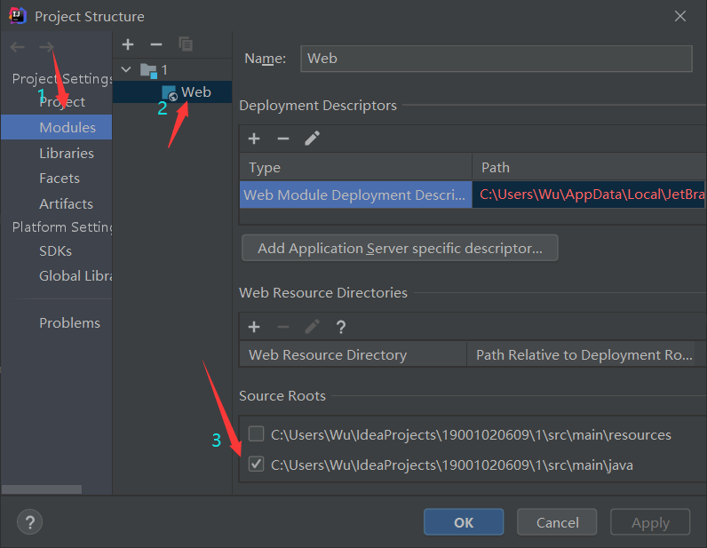
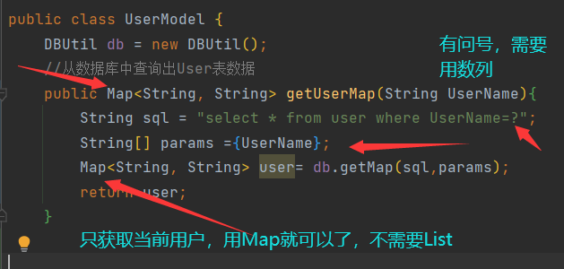
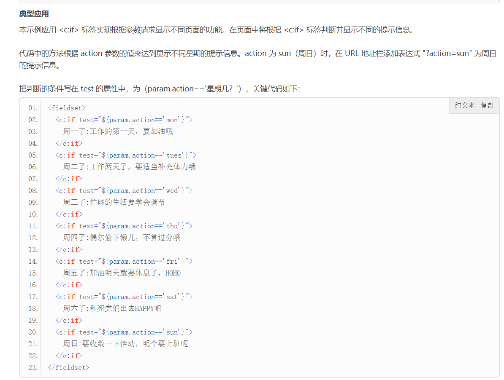

时有时无Servlet，从Project Structure 中找到 勾选即可
    
LogModel LogController  暂时完成 需要css美化 
    UserModel、UserController、User  暂未完成，明天找老师
    RegController、RegModel、Reg 暂时完成 需要css美化

<c:out> 输出
<c:forEach>循环
jsp页面一直出现${user.UserName}是因为EL表达式未生效
参考了https://blog.csdn.net/qq_41063141/article/details/8386594和https://www.cnblogs.com/cowshed/p/7775062.html的博客

获取用户数据时只需要获取当前用户，所以使用Map 获取列表时才需要使用List

UserController那里

el表达式：<c:if test="${user.UserName == 'admin'}"></c:if>  判定用单引号''。

没有把新闻分类的值传给addNews.jsp 回来解决
foodlist.jsp  传到Controller 再请求转发到addfood.jsp。  添加的结果 跳转到消息提示

显示新闻分类：NewsGroupModel从数据库获取数据，再由AddNewsController获取model中的数据，请求转发给addNews.jsp。

操作分为
操作数据，处理数据操作（是否操作成功）

新闻页面  用无序列表，${}获取新闻ID 匹配ID之后 显示新闻标题 点击进入新闻详情  进入详情后 观看新闻， 添加评论

判断是否为admin  然后跳进MainController  MainController从NewsModel获取数据 然后重定向到Main.jsp

用户数据 好像不太行

报错：For input string 

原因：Select.jsp 访问的是一个新闻的详情页面，而我在SelectController中向Select.jsp传输的却是一个List，用List调用对象属性，导致出现了这个情况

解决方法，改用Map即可

评论功能思路：	jsp页面 div 放一个评论框表单，然后提交到Controller，再传回jsp页面。

6.13遗留：

传递时间错误

SelectController还要有UserModel  加了之后 Select.jsp里的a标签就可以带User，News的ID了

点击评论按钮，跳转到ComController +新闻用户评论ID 页面，之后请求转发到Select页面再由Com.jsp跳转到DealAddComment页面

顺序：select获取到newsuserID -> comcontroller -> comjsp->Deal处理->交回给controller请求转发回Select.jsp